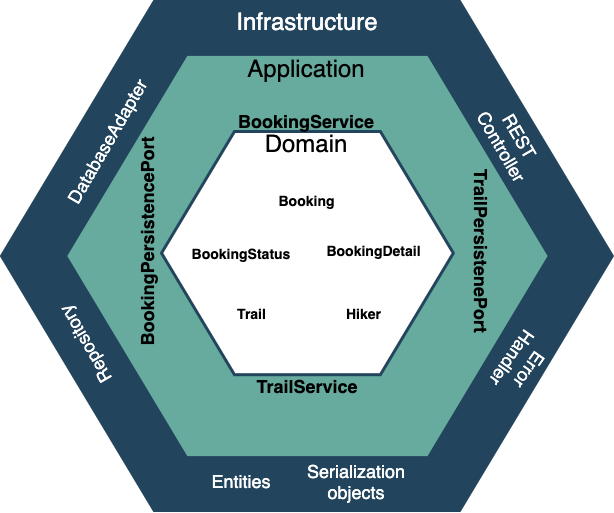

# Hiking Trail Service

## Technologies

* Java 11
* Gradle
* Springboot
* Mongo DB

## How to run

### What do I need?

* Docker compose
* Makefile (optional)

1. Using makefile, run
```shell
$ make start
```
This will build the dependencies (mongodb), build the app and run the containers
all in one process.

2. Seed the application's database

```shell
$ make seed-database
```

### API Documentation

1. See all trails:
```json
GET /trails
```

2. Find specific trail
```json
GET /trails/trailName
```

3. Book a trail
```json
POST /booking
requestBody: 
{
  "trailName": "Shire",
  "bookingDetails": {
    "hikers": [
      {
        "name": "Christine",
        "age": 31
      },
      {
        "name": "Raul",
        "age": 27
      }
    ]
  }  
}
```
You will get a bookingId in the response. Save this for the next request.

4. Find specific booking
```json
GET /booking/bookingId
```
5. Cancel a booking
```json
DELETE /booking/bookingId
```

There is also a postman collection in the root folder with all of these requests.

### Architecture Details

This service was built using the [hexagonal architecture](https://alistair.cockburn.us/hexagonal-architecture) design pattern.
You can see a diagram representing the application below:



The idea here is that we are decoupling the domain and use cases (services) of the application
from the external world (infastructure inputs and outputs) by reversing the dependency order.
The domain should not know anything about the external world. The dependency should go from:
external -> application -> domain, this way we can keep it pure and be ready for changes.


### About the tests

The application has around 30 tests, everything is covered. Two types of tests were made:
unit and integration.